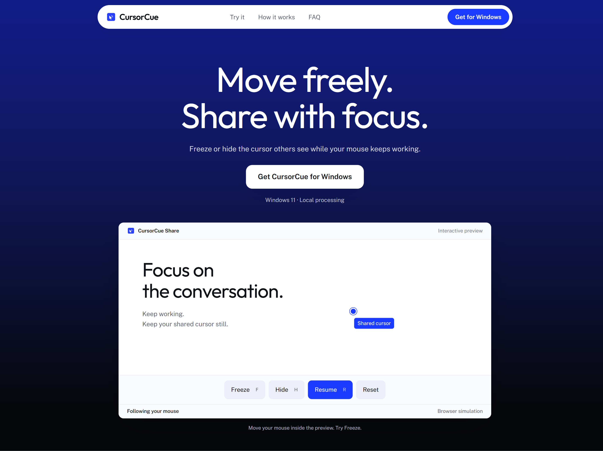

<p align="center">
  
</p>
<h1 align="center">CursorCue</h1>
<p align="center">Control the cursor others see while your mouse keeps working.</p>
<p align="center">Windows screen sharing for one-on-ones, team calls, reviews, walkthroughs, and presentations.</p>
<p align="center"><a href="https://cursorcue.pages.dev/">Visit the website</a></p>
<p align="center">
  <a href="https://github.com/sansynx/CursorCue/releases/download/v0.1.6/CursorCueSetup.exe">Download setup EXE</a> ·
  <a href="https://github.com/sansynx/CursorCue/releases/download/v0.1.6/CursorCue.msi">Download MSI</a> ·
  <a href="https://github.com/sansynx/CursorCue/releases/download/v0.1.6/CursorCue.exe">Download portable EXE</a>
</p>
<p align="center"></p>

## Downloads

Version **0.1.6** is an unsigned developer preview for Windows x64. Downloads require access to this private GitHub repository.

| File                                                                                                   | Use                                                               |
| ------------------------------------------------------------------------------------------------------ | ----------------------------------------------------------------- |
| [CursorCueSetup.exe](https://github.com/sansynx/CursorCue/releases/download/v0.1.6/CursorCueSetup.exe) | Recommended installer with a setup guide and Start menu shortcut. |
| [CursorCue.msi](https://github.com/sansynx/CursorCue/releases/download/v0.1.6/CursorCue.msi)           | The same per-user installation through Windows Installer.         |
| [CursorCue.exe](https://github.com/sansynx/CursorCue/releases/download/v0.1.6/CursorCue.exe)           | Run directly without installation.                                |

Quit older CursorCue copies before installing or running this build. Settings are preserved when upgrading the installed app.

## How to use

1. Open CursorCue and choose the app window you want to share.
2. In your meeting app, choose **Share a window**, then select **CursorCue Share**.
3. Work in the original app. Freeze or hide affects the shared cursor while your real mouse keeps moving and clicking.
4. Open **Size and shortcuts** or **Tools → Cursor size & shortcuts** to change cursor size, appearance, and keys. Click **Apply** to save.

The welcome instructions stay still when you use the mouse wheel. Resize the window or use its scrollbar if your display cannot fit the instructions. Settings remain scrollable.

| Action        | Default shortcut | Behavior                                                |
| ------------- | ---------------- | ------------------------------------------------------- |
| Freeze        | Ctrl + Shift + F | Hold the shared cursor in place.                        |
| Hide / reveal | Ctrl + Shift + H | Hide or restore the shared cursor.                      |
| Resume        | Ctrl + Shift + R | Reconnect it to your real mouse.                        |
| Drop          | Ctrl + Shift + D | Place it at your real mouse position and hold it there. |
| Toggle        | Ctrl + Shift + G | Stop or restart the selected window capture.            |

If another app uses a shortcut, choose a different combination or clear its key to disable it. The Tools menu remains available. Closing the window leaves CursorCue in the tray; choose **Quit CursorCue** to exit.

## Requirements and current limits

- Windows 11 x64 is the primary target. Windows 10 version 2004 or newer is best-effort.
- Keep the original app and CursorCue windows unminimized while sharing.
- Share the CursorCue window, not the original app or the entire desktop.
- Processing stays on your computer; the app has no account or cloud service.
- The current capture pipeline uses SDR BGRA8. HDR content can appear washed out.
- The cursor is inset slightly at frame edges to keep its whole shape visible.
- Test your meeting app and monitor setup before relying on this developer preview for a call.

## Build and check

Use Windows with Rust, Visual Studio 2022 Build Tools with Desktop C++ tools, the Windows SDK, and PowerShell 7. For the website, use Node.js and pnpm. No JavaScript runtime dependencies are required.

From a Developer PowerShell terminal:

```powershell
cd desktop
./assets/build-icon.ps1
cargo fmt --all --check
cargo clippy --workspace --all-targets -- -D warnings
cargo test --workspace -- --test-threads=1
cargo build --release --workspace
./installer/build-installer.ps1 -ExecutablePath ./target/release/cursorcue.exe -OutputDir ../release
```

The Cargo workspace version controls executable and installer version metadata. Each release gets a distinct product identity within the same upgrade family. The Windows CRT is linked statically.

```powershell
cd ../website
pnpm install
pnpm run check
pnpm run test
pnpm run dev
```

Open `http://127.0.0.1:4173/`. Website download links point to the GitHub release assets.

The live website is [cursorcue.pages.dev](https://cursorcue.pages.dev/). Cloudflare Pages publishes `website/dist` from `main`; the GitHub repository remains private.

The native executable also supports an isolated capture diagnostic:

```powershell
./target/release/cursorcue.exe --diagnostic --seconds=10
```

Installer lifecycle tests must use isolated product, upgrade, and component GUIDs and a matching test wrapper. The test script rejects production identities and mismatched payloads.
